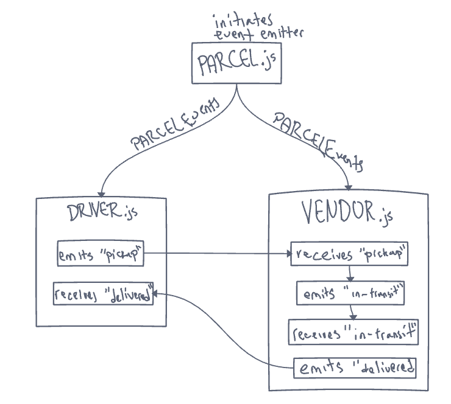

# CAPS - The Code Academy Parcel Service

Author: Justin Hamerly

## Problem Domain

*Phase 1:*  

build out a system that emulates a real world supply chain. CAPS will simulate a delivery service where vendors (such a flower shops) will ship products using our delivery service and when our drivers deliver them, be notified that their customers received what they purchased.  
Tactically, this is an event driven application that “distributes” the responsibility for logging to separate modules, using only events to trigger logging based on activity.

## Installation

* clone down repo onto your machine
* from terminal run the following commands:
  * `npm i` installs all dependencies
  * `node vendor` will run the vendor.js file

the terminal console log will display the events and the console logged activities.  the package info can be changed in the vendor.js file.

## UML

## LINKS AND ACCREDITATION

* Sarah Creager and Antoine Charette
